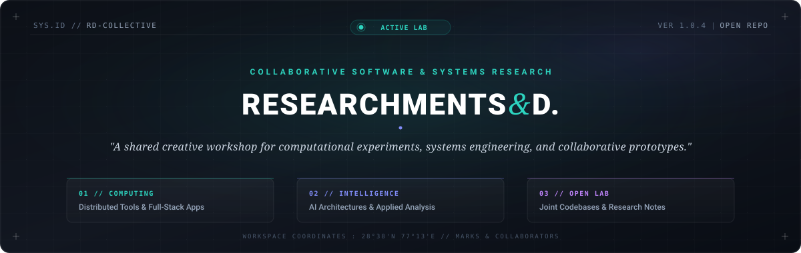

<div align="center">



<p align="center">
  <a href="LICENSE"></a>
  <a href="CONTRIBUTING.md"></a>
  <a href="#"></a>
  <a href="#"></a>
</p>

<p align="center">
  <strong>An open collaborative workspace for software engineering, applied research, and experimental prototyping.</strong>
</p>

---

</div>

## About the Collective

**Researchments & D.** is a shared collaborative studio established for Mark and team members to brainstorm, construct, and document experimental technology initiatives. From validating computational hypotheses and benchmarking models to building full-stack applications and utilities, this repository serves as our collective engineering workshop.

### Core Objectives

- **Rapid Prototyping:** Ideate and build proof-of-concept projects across diverse domains and technologies.
- **Collaborative Engineering:** Practice modern team workflows, branch conventions, peer reviews, and code standards.
- **Technical Documentation:** Document research methodologies, findings, architecture designs, and implementation notes.
- **Centralized Showcase:** Provide an organized index of individual and joint works.

---

## Repository Architecture

Every project is isolated within the `projects/` directory to ensure modularity, independent dependency management, and clean version tracking:

```text
Researchments-D/
├── .github/
│   ├── ISSUE_TEMPLATE/
│   │   ├── project_proposal.md     # Template for proposing new projects
│   │   └── bug_report.md           # Standard bug reporting format
│   └── PULL_REQUEST_TEMPLATE.md    # Checklist and guidelines for pull requests
├── assets/
│   └── banner.svg                  # Repository branding and graphics
├── docs/                           # Shared research papers, notes, and references
├── projects/                       # Directory containing all independent sub-projects
│   ├── README.md                   # Guide for organizing and adding projects
│   └── _template/                  # Starter template for new sub-projects
├── CONTRIBUTING.md                 # Contribution workflow, git standards, and setup
├── LICENSE                         # MIT License
└── README.md                       # Main documentation portal
```

---

## Projects Showcase

| Project | Description | Lead / Contributors | Stack / Domain | Status |
| :--- | :--- | :--- | :--- | :---: |
| *[Project Directory]* | *Brief overview of the tool, experiment, or paper* | *@username* | *Python / TypeScript / Go / etc.* | `In Development` |

> Details on how to submit a new project proposal and register it in this table can be found in [CONTRIBUTING.md](CONTRIBUTING.md).

---

## Contribution and Team Workflow

All team members follow a standard branching and review workflow:

1. **Proposal and Discussion:** Open an issue using the [Project Proposal](.github/ISSUE_TEMPLATE/project_proposal.md) template to align on objectives and tech stack.
2. **Branch Creation:** Create an isolated feature or research branch:
   ```bash
   git checkout -b feat/project-title
   # or for analytical and exploratory work:
   git checkout -b research/topic-title
   ```
3. **Development in `projects/`:** Initialize a dedicated directory under `projects/<project-title>` containing source code, environment specifications, and a project-level `README.md`.
4. **Pull Request:** Push the branch to GitHub and create a Pull Request against `main`. Assign teammates for review.
5. **Review and Integration:** After passing review, merge into `main` and update the Projects Showcase table.

Read the complete specifications in [CONTRIBUTING.md](CONTRIBUTING.md).

---

## Contributors and Maintainers

Coordinated by **[@marksrv047](https://github.com/marksrv047)** and collaborators.

<div align="left">
  <a href="https://github.com/marksrv047/Researchments-D/graphs/contributors">
    
  </a>
</div>

---

## License

This repository is distributed under the terms of the [MIT License](LICENSE).
